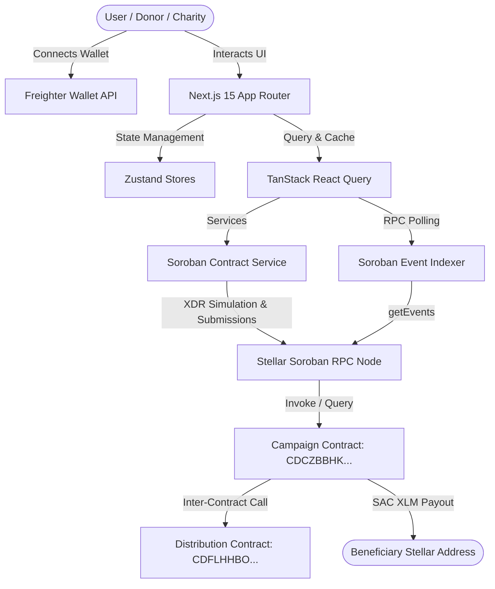

# GiveChain — Transparent Charity Fund Distribution System

[](https://github.com/rajesh31nov/give-chain/actions)
[](https://stellar.org)
[](https://soroban.stellar.org)
[](https://nextjs.org)
[](https://www.typescriptlang.org/)
[](https://opensource.org/licenses/MIT)

**GiveChain** is a production-quality, blockchain-powered charity fund distribution platform built on **Stellar** and powered by **Soroban Smart Contracts**. GiveChain enables donors to contribute XLM directly into secure smart contract vaults, allows verified charity organizations to register beneficiaries with allocation bounds, and executes transparent, batch distribution payouts with verifiable end-to-end on-chain provenance.

---

## 📋 Table of Contents

- [Problem Statement](#-problem-statement)
- [Why Stellar & Soroban?](#-why-stellar--soroban)
- [Architecture & System Flow](#-architecture--system-flow)
- [Smart Contract Layer](#-smart-contract-layer)
- [Role-Based Access Control (RBAC)](#-role-based-access-control-rbac)
- [Deployed Testnet Contracts & Verified Transactions](#-deployed-testnet-contracts--verified-transactions)
- [Key Features](#-key-features)
- [Tech Stack](#-tech-stack)
- [Local Development Quickstart](#-local-development-quickstart)
- [Testing & Quality Verification](#-testing--quality-verification)
- [CI/CD Pipeline](#-cicd-pipeline)
- [Evaluator & Judge Quickstart](#-evaluator--judge-quickstart)
- [Security & Upgrade Strategy](#-security--upgrade-strategy)
- [Troubleshooting](#-troubleshooting)

---

## ❓ Problem Statement

Traditional charitable fund distribution systems suffer from significant operational inefficiencies:

1. **Opacity in Fund Movement**: Donors rarely have visibility into whether their contributions reach intended recipients or get absorbed by administrative overhead.
2. **Double Distribution & Fraud**: Lack of centralized, immutable tracking enables double-spending and unverified beneficiary payouts.
3. **Manual Reconciliation Bottlenecks**: Distributing financial aid to hundreds of recipients requires manual bank transfers, leading to days of delay during humanitarian emergencies.

**GiveChain solves these issues** by encoding fundraising targets, donor contributions, beneficiary approval limits, and batch payouts into Soroban smart contracts on the Stellar blockchain.

---

## ⚡ Why Stellar & Soroban?

- **Sub-Second Finality & Low Transaction Fees**: Stellar processes transactions in 3–5 seconds with near-zero network fees, ensuring maximum donor capital reaches beneficiaries.
- **Stellar Asset Contract (SAC) Native Integration**: Interoperable with native XLM and custom Stellar tokens via native Soroban token client abstractions.
- **On-Chain Event Streaming**: Real-time event topics (`campaign.donated`, `batch.executed`) allow frontends to maintain instant event feeds without heavy centralized indexing databases.
- **Soroban Storage TTL Extension**: Custom TTL management prevents state eviction while keeping ledger footprints lightweight and production-ready.

---

## 🏗 Architecture & System Flow



---

## 📜 Smart Contract Layer

GiveChain relies on **two inter-communicating Soroban smart contracts** written in Rust:

### 1. `givechain_campaign` Contract
- **Responsibility**: Manages campaign creation, owner authorization, XLM vault deposits, campaign state transitions (`Draft` $\rightarrow$ `Active` $\rightarrow$ `Paused` $\rightarrow$ `Completed`), and triggers inter-contract distribution executions.
- **Storage**: Persistent storage layout with Soroban TTL extension (`extend_ttl`).
- **Events Emitted**: `(campaign, created)`, `(campaign, status)`, `(campaign, donated)`, `(campaign, distrib)`.

### 2. `givechain_distribution` Contract
- **Responsibility**: Manages beneficiary registration, platform admin approval, allocation limits per beneficiary, distribution batch creation, and execution state checks.
- **Double Distribution Guard**: Asserts that `received_amount + requested_amount <= allocated_amount` and marks batch IDs as executed to prevent re-entrancy or duplicate payouts.
- **Events Emitted**: `(beneficiary, reg)`, `(beneficiary, approved)`, `(batch, created)`, `(batch, executed)`.

### Inter-Contract Communication Flow
$$\text{CampaignContract.execute\_batch\_distribution()} \xrightarrow{\text{Cross-Contract Call}} \text{DistribContract.verify\_and\_lock\_batch()}$$
$$\text{CampaignContract.transfer(SAC\_XLM)} \xrightarrow{\text{Direct Token Transfer}} \text{Beneficiary Stellar Address}$$
$$\text{CampaignContract} \xrightarrow{\text{Mark Complete}} \text{DistribContract.mark\_batch\_executed()}$$

---

## 🔐 Role-Based Access Control (RBAC)

| Role | Authorized Actions | Restricted Actions |
| :--- | :--- | :--- |
| **Donor** | Browse campaigns, donate XLM, view transaction center, track provenance | Cannot create campaigns, approve beneficiaries, or trigger distribution batches |
| **Charity Org** | Create campaigns, register beneficiaries, create distribution batches, execute payouts | Cannot approve beneficiaries at platform level |
| **Beneficiary** | View allocation limits, view received payouts, view explorer links | Cannot alter allocations or create distribution batches |
| **Platform Admin**| Approve registered beneficiaries, monitor platform analytics, initialize contracts | Restricted to governance oversight |

---

## 🌐 Deployed Testnet Contracts & Verified Transactions

GiveChain is fully deployed and verified on **Stellar Testnet**:

### Deployed Contract Addresses

| Contract | Stellar Testnet Contract ID | WASM Hash |
| :--- | :--- | :--- |
| **Campaign Contract** | `CDCZBBHKFAUSZO7JEGSQ3VAFFD3CZ3VI4THB4SWZWOGATZ4LNGGUN3BF` | `8d2933d14793e3c50cca09f5a0f0d1d759b05d7807eabf9d984b894eb76dca6c` |
| **Distribution Contract**| `CDFLHHBOOH4WBNTLDVSGMMVDJRYFKDCS63KTUK4IUEVY6TGOV7KQY5XO` | `932611b6713bf5d30697639faf3430c16e2a95e3f90b6b16a0d11d528460e8dd` |
| **Native XLM SAC** | `CDLZFC3SYJYDZT7K67VZ75HPJVIEUVNIXF47ZG2FB2RMQQVU2HHGCYSC` | Standard Testnet Native Asset Contract |

### Verified On-Chain Transactions

1. **Campaign Creation**: [`fe01db2f10...`](https://stellar.expert/explorer/testnet/tx/fe01db2f10adaaa2d13588d4ff9bcac7c499887e7b060dab2aba7ab88c8f7463) (*Created Campaign #1: Flood Relief 2026*).
2. **Campaign Activation**: [`fd0a969ebb...`](https://stellar.expert/explorer/testnet/tx/fd0a969ebb0d4600b55ae96e2664e9e80272751ebbd7402eb7d3557fd53d1438) (*Transitioned Draft $\rightarrow$ Active*).
3. **Real 100 XLM Donation**: [`d17ed288d0...`](https://stellar.expert/explorer/testnet/tx/d17ed288d01e0e8fbaac4dba2fd15dac243bca189ceb825d03c1e2c0623d82de) (*100 XLM transferred into Soroban Campaign Vault*).
4. **Beneficiary Registration**: [`167e2677d8...`](https://stellar.expert/explorer/testnet/tx/167e2677d8737c902ed33894a93822464c868cb66dbfebf6eddcf3137ea77c50) (*Registered allocation limit 50 XLM*).
5. **Beneficiary Approval**: [`ee5bd5d973...`](https://stellar.expert/explorer/testnet/tx/ee5bd5d973bf7d6adce6bc76123f879ac786ba5e8368b5ebfd74efded2c6afac) (*Admin approved beneficiary*).
6. **Distribution Batch Creation**: [`dd1e95f5c0...`](https://stellar.expert/explorer/testnet/tx/dd1e95f5c0712f383bd2a9eeeb0de08c88438e7986460207d9658e0ffc6678e7) (*Created Batch #1*).
7. **Real Inter-Contract Batch Distribution Payout**: [`eff854809f...`](https://stellar.expert/explorer/testnet/tx/eff854809ff8b5f4402ca81b6f7e5b6bd5fefd2d6e2b4761cbda6c5964efdd9a) (*50 XLM disbursed directly to beneficiary address*).

---

## 🛠 Tech Stack

| Layer | Technology | Description |
| :--- | :--- | :--- |
| **Frontend Framework** | Next.js 15 (App Router) | Server & Client Components, React 19 |
| **Language** | TypeScript 5.x | Strict type safety across all components & services |
| **Styling** | Tailwind CSS & shadcn/ui | Dark mode UI with custom CSS variables |
| **State Management** | Zustand | Persistent wallet session & transaction lifecycle state |
| **Data Fetching** | TanStack React Query v5 | Server state caching, stale-time management, & auto-polling |
| **Blockchain SDK** | `@stellar/stellar-sdk` | Soroban RPC client, XDR builders, & ScVal parsers |
| **Wallet Integration** | `@stellar/freighter-api` | Freighter wallet connection & transaction signing |
| **Smart Contracts** | Soroban / Rust (`soroban-sdk`) | Production-ready smart contract layer |
| **Testing** | Vitest & React Testing Library | 22 unit, component, RBAC, and integration tests |
| **Contract Testing** | Cargo Test | 9 Rust contract unit, panic, & inter-contract tests |
| **CI/CD** | GitHub Actions | Automated quality pipeline enforcing builds, tests, & lints |

---

## 💻 Local Development Quickstart

### Prerequisites
- **Node.js**: `v20.x` or higher
- **npm**: `v10.x` or higher
- **Rust**: `v1.80+` with target `wasm32-unknown-unknown`
- **Stellar CLI** (optional for deployment): `v25.x`

### Step 1: Clone Repository & Install Dependencies
```powershell
git clone https://github.com/rajesh31nov/give-chain.git
cd give-chain
npm ci
```

### Step 2: Configure Environment Variables
Copy `.env.example` to `.env.local`:
```powershell
cp .env.example .env.local
```
Ensure `.env.local` contains:
```env
NEXT_PUBLIC_STELLAR_NETWORK=testnet
NEXT_PUBLIC_SOROBAN_RPC_URL=https://soroban-testnet.stellar.org
NEXT_PUBLIC_HORIZON_URL=https://horizon-testnet.stellar.org
NEXT_PUBLIC_CAMPAIGN_CONTRACT_ID=CDCZBBHKFAUSZO7JEGSQ3VAFFD3CZ3VI4THB4SWZWOGATZ4LNGGUN3BF
NEXT_PUBLIC_DISTRIBUTION_CONTRACT_ID=CDFLHHBOOH4WBNTLDVSGMMVDJRYFKDCS63KTUK4IUEVY6TGOV7KQY5XO
```

### Step 3: Run Next.js Development Server
```powershell
npm run dev
```
Open `http://localhost:3000` in your browser.

---

## 🧪 Testing & Quality Verification

GiveChain includes a complete testing suite:

```powershell
# 1. Run TypeScript type safety check
npm run typecheck

# 2. Run non-interactive ESLint code check
npm run lint

# 3. Run Vitest frontend test suite (22 tests)
npm run test

# 4. Build Next.js 15 production bundle
npm run build

# 5. Run Soroban smart contract tests (9 Rust tests)
cargo test

# 6. Build optimized Soroban WASM binaries
cargo build --target wasm32-unknown-unknown --release
```

---

## 🚀 CI/CD Pipeline

GiveChain uses GitHub Actions ([`.github/workflows/ci.yml`](.github/workflows/ci.yml)) to run automated checks on every push or pull request to `main`:

```yaml
jobs:
  frontend-ci:
    runs-on: ubuntu-latest
    steps:
      - uses: actions/checkout@v4
      - uses: actions/setup-node@v4
      - run: npm ci
      - run: npm run typecheck
      - run: npm run lint
      - run: npm run test
      - run: npm run build

  contracts-ci:
    runs-on: ubuntu-latest
    steps:
      - uses: actions/checkout@v4
      - uses: dtolnay/rust-toolchain@stable
      - uses: Swatinem/rust-cache@v2
      - run: cargo test
      - run: cargo build --target wasm32-unknown-unknown --release
```

---

## 🎯 Evaluator & Judge Quickstart

1. Open the web app at `http://localhost:3000`.
2. Click **"Connect Wallet"** in the top navigation header (requires [Freighter Extension](https://freighter.app) set to Testnet).
3. Navigate to **Campaigns** (`/campaigns`) and select *Flood Relief 2026*.
4. Select a preset donation amount (e.g., `100 XLM`) and submit. Approve the transaction popup in Freighter.
5. Watch the **Transaction Status Badge** transition: `Idle` $\rightarrow$ `Preparing` $\rightarrow$ `Awaiting Wallet` $\rightarrow$ `Submitting` $\rightarrow$ `Confirmed`.
6. Click **"View on Stellar Explorer"** to inspect the live confirmation hash on Stellar Expert.
7. Open **Activity Feed** (`/activity`) to view normalized real-time ledger events.
8. Open **Analytics** (`/analytics`) to view platform-wide fund breakdown charts.

---

## 🛡 Security & Upgrade Strategy

- **Double Distribution Prevention**: Smart contract state enforces allocation bounds per beneficiary and records executed batch IDs to block re-entrancy or duplicate payouts.
- **Admin Governance & Upgrades**: Contracts expose an `upgrade(new_wasm_hash)` function restricted strictly to contract admin authorization via `admin.require_auth()`.
- **Secret Isolation**: Zero secret keys, seed phrases, or private credentials are stored in code or repository commits.

---

## ❓ Troubleshooting

### 1. Freighter Wallet Fails to Connect
- Ensure the Freighter extension is set to **Testnet** under Network Settings.
- Fund your test address with free Testnet XLM at [Stellar Laboratory Friendbot](https://lab.stellar.org/frontend/fund-account).

### 2. Transaction Simulation Fails
- Ensure your wallet balance is greater than the donation amount plus network fee (~0.00001 XLM).
- Check that the contract address in `.env.local` matches `CDCZBBHK...`.

---

## 📄 License

This project is licensed under the [MIT License](LICENSE).
